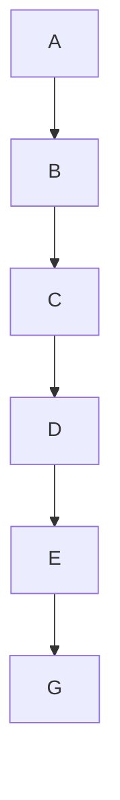

# PIC18F
Plantilla para usar con el PIC18

# <strong> Ejercicio☕ </strong> (ejemplo)

Se dispone de un sistema expendedor de variedades de cafe, que es controlado por una plaqueta
que utiliza el microcontrolador <strong>PIC18F4550</strong>. Cuenta con un teclado de 16 teclas para la
seleccion de sus 7 productos, construido internamente como un teclado matricial de 4 x 4.
Tambien cuenta con <strong>display LCD inteligente 16 caracteres, 2 lineas</strong> utilizado para indicar
el importe del producto seleccionado.
Al seleccionar alguno de los productos disponibles, se debe activar el monedero (LD2
LED1 que al principio esta desactivado); permitiendo de este modo que ingresen las monedas
de 25, 50 centavos, 1 y 2 pesos. El mecanismo utilizado para la detecci´on de la moneda NO ES
DE NUESTRA INCUMBENCIA. A los efectos del problema, seg´un el valor de la moneda
ingresada se activar´a (nivel bajo) una de las cuatro lineas RD4(moneda de $2) , RD5(moneda
de $1), RD6(moneda de $0,5), RD7(moneda de $0,25) (use dip-switch para remplazar los
botones).

• El teclado esta conectado al puerto B. (Ya
lo tiene resuelto en el entrenador.)

• Debe considerar el rebote de las teclas.

• El display est´an conectados en los mismos
pines que en el entrenador.

• Al momento de seleccionar una bebida (al
presionar una tecla) se debe activar el timer por 5 segundos para que el usuario ingrese las monedas (en
nuestro caso, se ajustan los dip-switch que representan
las monedas).

<strong> Una vez finalizado el tiempo, debe: </strong>

• Desactivar el monedero (LED1)

• Inhibir el teclado (deja de atender la opresi´on de una tecla)

• Activar la salidas correspondientes (LD3, LC6 y LC7) durante el tiempo indicado
en la tabla.

• Mostrar en el display la tarifa del producto seleccionado con coma.

Luego un dispositivo electromecanico que NO ES DE NUESTRA INCUMBENCIA procede a servir el vaso durante un tiempo de 20 segundos. A partir de all´ı, debe dejar
la maquina preparada para una proxima operacion.

Tabla de transición de estados:

| N° de tecla | Producto seleccionado  | Importe  | LD3 | LC6  | LC7  | Tiempo |
| --- | --- | --- | --- | --- | --- | --- |
| 1  | Cafe solo amargo | $2,50  | 0 | 0 | 1 | 15s |
| 2 | Cafe solo dulce  | $3,00 | 0 | 1 | 0 | 15s |
| 3 | Cafe con leche amargo  | $2,75 | 0 | 1 | 1 | 25s |
| 4 | Cafe con leche dulce | $3,25  | 1 | 0 | 0 | 25s |
| 5 | Cafe con leche muy dulce | $3,50 | 1 | 0 | 1 | 25s |
| 6 | Capuchino amargo | $4,00 | 0 | 1 | 0 | 15s |
| 7 | Capuchino dulce | $4,25  | 1 | 0 | 0 | 25s |

# <strong> Simualcion </strong>

https://www.youtube.com/watch?v=cZwTsTdGOHY

